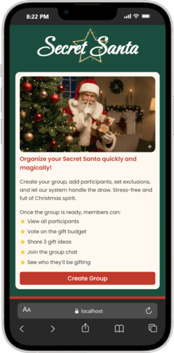

# Secret Santa 🎅

Secret Santa is a full-stack web application that helps groups organize a Secret Santa exchange without the usual confusion.
It handles participants, exclusions, gift budget voting, wishlists, chat, and the final draw.

The goal of this project was to build something close to a real-world product, not just a demo or tutorial app.

## Table of contents

- [Overview](#overview)
  - [Screenshot](#screenshot)
  - [Links](#links)
- [My process](#my-process)
  - [Architecture & Design Decisions](#architecture-and-design-decisions)
  - [Features](#features)
  - [Built with](#built-with)
  - [What I learned](#what-i-learned)
  - [Continued development](#continued-development)
  - [Useful resources](#useful-resources)
- [Author](#author)
- [Acknowledgments](#acknowledgments)

## Overview

The organizer starts by creating a group and submitting their email address.
Before anything else happens, the organizer must confirm and validate the group through a verification email. This step ensures that only valid groups can continue.

Once the group is confirmed, each participant receives an email with a button that takes them directly to their private page.

On their personal page, members can:

- See all participants in the group
- Vote on the gift price range
- Interact through a public group chat

After all members have voted, each participant can:

- Choose to add up to three wishlist items. These are visible only to the person assigned to buy the gift, which is especially helpful for groups where participants may not know each other well.

- reveal their Secret Santa and see the wishlist of the person they are buying a gift for, making the exchange easier and more thoughtful.

### Screenshot

**Mobile Version**

**Laptop Version**

### Links

- Live Site URL: [Secret Santa](https://secret-santa-bnb.netlify.app/)

## My process

### Architecture and Design Decisions

### Authentication Strategy: Why Token-Based (Magic Links)?

While building this project, my main goal was to find a good balance between **privacy** and **ease of use**, especially for people who are not very comfortable with technology.

I decided to go with a **token-based authentication system using email (magic links)**. Below I explain the reasoning behind this choice and why other approaches didn’t feel right for this project.

<strong>More details about the authentication design</strong>

#### 1. The “Organizer Dilemma” (Privacy)

In many Secret Santa apps, the organizer ends up having admin access that allows them to see who drew whom.  
In my view, this completely defeats the purpose of the game and ruins the surprise.

**My approach:**  
The draw and pairing process is fully automated on the server, and **each participant receives a unique private link** sent directly to their own email address.  
There is no admin screen or endpoint that exposes the results. This means that **no one — including the organizer — can see anyone else’s assignment**.

#### 2. User Experience (UX) & Accessibility

A Secret Santa group usually includes people of different ages and very different levels of technical experience.

- **Why not a classic username/password login?**  
  Asking users to create and remember yet another password adds unnecessary friction. In practice, people forget passwords, and that would require the organizer to step in and handle resets, which is neither user-friendly nor ideal for privacy.

- **Why not one-time (burn-after-reading) links?**  
  While they can be secure, one-time links don’t work well with the idea behind this app.  
  This project includes features like wishlists, polls, and chat, which users may want to revisit multiple times. If someone accidentally closes the page or wants to come back later, losing access permanently would be a poor experience.  
  Persistent email-based links felt like a much better fit.

#### 3. Security vs. Convenience Trade-offs

I also considered alternatives that do not rely on email, but they came with important downsides:

- **Public group link + name selection + PIN:**  
  This approach is prone to mistakes or abuse (for example, someone selecting the wrong name and locking that participant out).

- **Shared personal information (date of birth, phone number, etc.):**  
  These are weak as authentication secrets and are often already known by the organizer, which defeats the privacy goal.

**Verdict:**  
Email-based magic links provide a **private, unique, and persistent way** for each participant to access their own page, without accounts, passwords, or complex setup.  
While it can be a bit tedious for the organizer to enter all participant emails at the start, I believe this trade-off is worth it, as it makes the experience much simpler and smoother for everyone afterwards.

### Features

- Create a Secret Santa group with email verification
- Invite participants using secure tokens
- Optional organizer participation
- Exclusion rules (with validation to prevent impossible draws)
- Gift budget voting
- Public group chat
- Personal wishlist (up to 3 items per member)
- Final Secret Santa reveal
- Responsive layout (mobile-first)
- Accessibility-focused HTML and form semantics

### Built with

**Frontend**

- React (Vite)
- React Router
- Plain CSS (component-scoped)
- Semantic HTML + accessibility attributes

**Backend**

- Node.js
- Express
- MongoDB with Mongoose
- Brevo (Sendinblue) Transactional Email API
- NanoID / UUID for tokens

**Tooling**

- Concurrently
- Git & GitHub
- Environment variables

### What I learned

This project helped me revisit and deepen many of the concepts I learned during my full-stack bootcamp, especially around backend routing, frontend–backend communication, and state persistence.

**Some key takeaways:**

- Structuring backend routes in a scalable and maintainable way
- Coordinating state across frontend, backend, URL tokens, and localStorage
- Building resilient multi-step forms with draft recovery
- Designing validation logic that prevents impossible states (such as invalid exclusion combinations)
- Using secure, token-based access instead of traditional authentication
- Handling transactional emails through an external API rather than a local SMTP setup
- Making pragmatic architectural trade-offs based on project scope and complexity

### Continued development

- Improve error handling and user feedback across the app
- Add automated tests for both frontend and backend
- Explore real-time updates (e.g. WebSockets) instead of polling
- Improve performance and scalability

### Useful resources

- [MDN Web Docs](https://developer.mozilla.org/) - Constant reference for HTML, CSS, and JS.
- [React Docs](https://react.dev/) - Official guidance for hooks and component patterns.
- [MongoDB Manual](https://www.mongodb.com/docs/manual/) – Reference for core MongoDB concepts and database operations.
- [Mongoose Docs](https://mongoosejs.com/docs/) – Used for schema design and data validation.

## Author

- Website - [Tiago Pereira](https://social-links-buildandbreak.netlify.app/)
- Frontend Mentor - [@BuildAndBreak](https://www.frontendmentor.io/profile/BuildAndBreak)
- Linkedin - [Tiago Pereira](https://www.linkedin.com/in/tiago-pereira-5a4698289/)
- Github - [@BuildAndBreak](https://github.com/BuildAndBreak)

## Acknowledgments

Thanks to [@WebDevSimplified](https://www.youtube.com/@WebDevSimplified) for clear explanations on frontend architecture and UI patterns.

Thanks to [@TraversyMedia](https://www.youtube.com/@TraversyMedia) for clear explanations of backend routing, REST APIs, and Express fundamentals.
